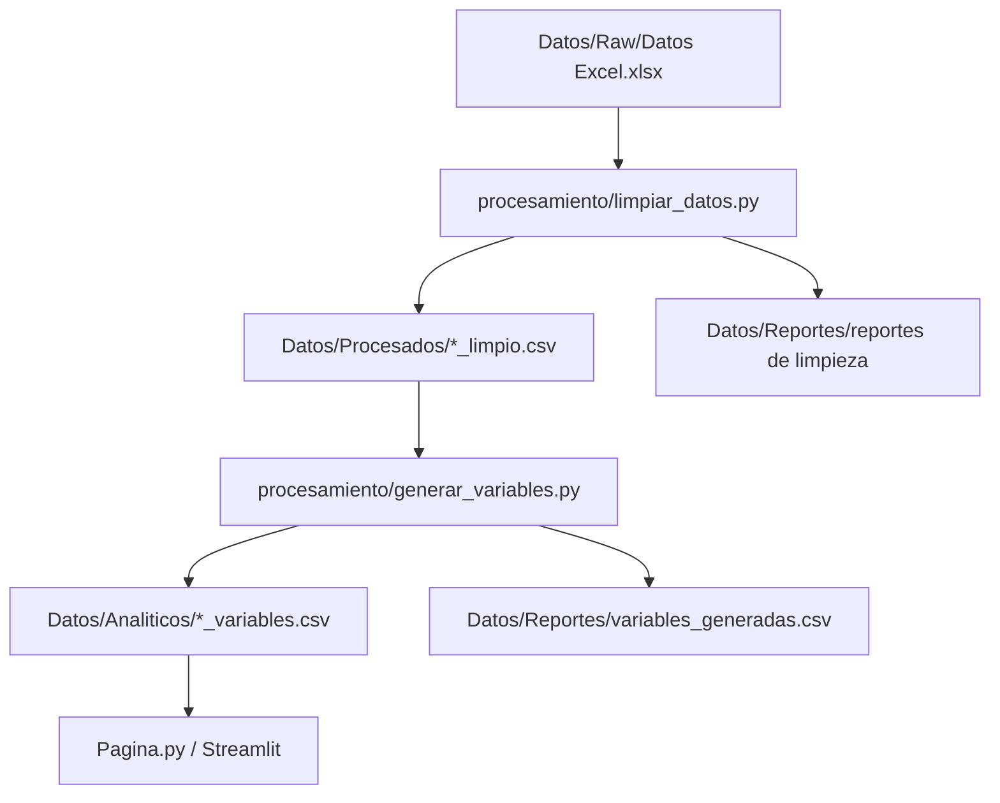

# Informe del proyecto Bloques y Sensores

Fecha de actualizacion: 2026-06-18

## 1. Objetivo

Este informe documenta el trabajo realizado hasta ahora en el proyecto
**Bloques y Sensores**, dentro del repositorio `Pagina-Web`.

El objetivo del proyecto es preparar una base ordenada para construir una
pagina web en Streamlit que permita analizar datos de bloques, sensores,
cortinas, clima y radiacion.

Por ahora el foco ha sido:

- Organizar el repositorio.
- Proteger los datos originales.
- Limpiar los datos sin perder informacion valida.
- Crear variables derivadas con sentido analitico.
- Dejar documentado el flujo para continuar con graficas y analisis
  estadistico.

## 2. Estado general del repositorio

Repositorio remoto:

```text
https://github.com/juandavidtejedormedina-hub/Pagina-Web.git
```

Commits principales realizados:

```text
b35d73f Preparar proyecto Streamlit
fa66b10 Organizar datos y agregar limpieza inicial
c170ad4 Ajustar limpieza conservadora y documentar datos
702e037 Agregar estructura para proyectos futuros
16546d3 Agregar variables derivadas analiticas
```

## 3. Estructura actual

Captura textual de la estructura principal:

```text
PaginaTejedor/
  Pagina.py
  README.md
  requirements.txt
  run.ps1
  Datos/
    Raw/
      Datos Excel.xlsx
    Procesados/
      *_limpio.csv
    Analiticos/
      *_variables.csv
    Reportes/
      resumen_limpieza.csv
      reglas_aplicadas.csv
      duplicados_por_llave.csv
      nulos_por_columna.csv
      variables_generadas.csv
      nulos_variables.csv
  procesamiento/
    limpiar_datos.py
    generar_variables.py
  docs/
    diccionario_datos.md
    variables_derivadas.md
    informe_bloques_y_sensores.md
  proyectos/
    bloques_y_sensores/
    accrel_y_reservorios/
```

Los archivos de datos originales y generados estan ignorados en Git para no
subir informacion sensible por accidente. Se versionan los scripts, la
documentacion y la estructura de carpetas.

## 4. Proyectos definidos

Se dejo preparada una estructura para manejar mas de un proyecto:

| Proyecto | Estado | Descripcion |
| --- | --- | --- |
| Bloques y Sensores | Activo | Analisis de bloques, sensores WIGGA, cortinas, EcoWitt, Apogee y apertura. |
| Accrel y Reservorios | Futuro | Carpeta reservada para trabajar mas adelante. |

## 5. Fuentes de datos

El archivo original se conserva sin modificar en:

```text
Datos/Raw/Datos Excel.xlsx
```

Este Excel contiene los siguientes grupos:

| Grupo | Descripcion | Uso esperado |
| --- | --- | --- |
| WIGGA | Variables ambientales por bloque: temperatura, humedad, DPV, radiacion, punto de rocio, gramos de agua, bateria, EVT. | Comparar bloques y analizar ciclos ambientales. |
| Cortinas | Registros de apertura/cierre de cortinas con motores, frentes, puertas y observaciones. | Analizar operacion, horarios, duracion y novedades. |
| Analisis Apertura | Tabla tecnica de apertura en metros y areas calculadas en m2. | Contextualizar capacidad, apertura real, brechas y eficiencia. |
| EcoWitt | Clima externo: temperatura, viento, presion, lluvia, humedad, direccion del viento. | Comparar ambiente externo contra ambiente interno. |
| Apogee | Variables de radiacion/luz: PPFD y lux. | Comparar luz externa o puntual contra radiacion y comportamiento de cortinas. |

## 6. Flujo de datos

Diagrama del flujo actual:



## 7. Limpieza realizada

Script principal:

```text
procesamiento/limpiar_datos.py
```

Criterios aplicados:

- El Excel original no se modifica.
- Los ceros validos se conservan, por ejemplo radiacion `0`, lluvia `0`,
  apertura `0` o porcentaje `0`.
- Solo se eliminan duplicados exactos.
- Se eliminan filas sin fecha/hora util cuando no sirven para analisis
  temporal.
- En cortinas se eliminan filas sin elemento y duplicados exactos.
- Los duplicados por llave de negocio se reportan, pero no se eliminan
  automaticamente porque pueden representar eventos reales.
- Los nulos se reportan para decidir mas adelante si se filtran, imputan o se
  dejan como ausencia real de medicion.

Resultado actual de limpieza:

| Dataset | Filas | Columnas | Duplicados exactos |
| --- | ---: | ---: | ---: |
| wigga | 26,885 | 17 | 0 |
| cortinas | 254 | 13 | 0 |
| ecowitt | 13,199 | 8 | 0 |
| apogee | 13,199 | 3 | 0 |
| analisis_apertura | 4 | 17 | 0 |
| analisis_apertura_areas | 4 | 18 | 0 |

Reglas relevantes aplicadas:

| Dataset | Regla | Filas removidas |
| --- | --- | ---: |
| WIGGA | fecha_hora_vacia_o_invalida | 0 |
| WIGGA | duplicados_exactos | 0 |
| Cortinas | elemento_vacio | 2 |
| Cortinas | duplicados_exactos | 4 |
| EcoWitt | duplicados_exactos | 0 |
| Apogee | duplicados_exactos | 0 |
| Analisis Apertura | duplicados_exactos | 0 |
| Analisis Apertura Areas | duplicados_exactos | 0 |

## 8. Separacion de Analisis Apertura

La hoja `Analisis Apertura` no era una sola tabla limpia. Tenia dos tablas
apiladas:

- Una tabla de medidas y aperturas en metros.
- Una tabla de areas calculadas en m2, brechas y porcentajes.

Por eso se separo en:

```text
Datos/Procesados/analisis_apertura_limpio.csv
Datos/Procesados/analisis_apertura_areas_limpio.csv
```

Esta decision evita mezclar columnas con significados distintos y permite
hacer graficas o indicadores mas confiables.

## 9. Variables derivadas

Script principal:

```text
procesamiento/generar_variables.py
```

La etapa de variables derivadas toma los CSV limpios desde `Datos/Procesados/`
y genera archivos en `Datos/Analiticos/`.

La regla usada fue crear columnas solo cuando ayudan a un analisis posterior.
No se agregaron variables solo por aumentar el numero de columnas.

Resultado actual:

| Dataset analitico | Filas | Columnas |
| --- | ---: | ---: |
| wigga_variables.csv | 26,885 | 80 |
| cortinas_variables.csv | 254 | 26 |
| ecowitt_variables.csv | 13,199 | 29 |
| apogee_variables.csv | 13,199 | 21 |
| analisis_apertura_variables.csv | 4 | 27 |
| analisis_apertura_areas_variables.csv | 4 | 23 |

Cantidad de variables generadas por dataset:

| Dataset | Variables generadas |
| --- | ---: |
| wigga | 63 |
| cortinas | 13 |
| ecowitt | 21 |
| apogee | 18 |
| analisis_apertura | 10 |
| analisis_apertura_areas | 5 |

## 10. Logica de variables por dataset

### WIGGA

Variables creadas:

- Variables temporales: anio, mes, dia, semana, hora, periodo del dia.
- Variables ciclicas: seno/coseno de hora y dia del anio.
- Indicador `es_dia`, conservando radiacion `0`.
- Intervalo entre mediciones.
- Diferencia entre temperatura y punto de rocio.
- Indicador de riesgo de condensacion.
- Amplitud de temperatura y humedad.
- Cambios respecto a la medicion anterior.
- Rezagos de 1h, 6h y 24h por bloque.
- Diferencias contra 1h y 24h.
- Promedios moviles de 3h, 6h y 24h.
- Radiacion acumulada y maximos/minimos diarios progresivos.

Razon:

Estas variables permiten estudiar ciclos diarios, comparaciones entre bloques,
tendencias recientes, memoria temporal, riesgo de condensacion y relacion entre
radiacion, humedad, DPV y temperatura.

### Cortinas

Variables creadas:

- Hora de apertura y cierre en minuto del dia.
- Hora de apertura y cierre en formato decimal.
- Duracion abierta en minutos.
- Indicador de existencia de observacion.
- Tipo de elemento: frente, puerta u otro.

Razon:

Estas columnas permiten analizar operacion de cortinas, horarios, duraciones,
diferencias por bloque y eventos con observaciones.

### EcoWitt

Variables creadas:

- Variables temporales y ciclicas.
- Intervalo entre mediciones.
- Componentes numericos del viento: `viento_u_mps`, `viento_v_mps`.
- Sector de viento.
- Cambio de temperatura.
- Promedios moviles de temperatura y humedad en 1h.

Razon:

Estas variables ayudan a comparar clima externo contra condiciones internas de
los bloques.

### Apogee

Variables creadas:

- Variables temporales y ciclicas.
- Intervalo entre mediciones.
- Indicador de presencia de luz.
- Promedios moviles de PPFD y lux en 1h.

Razon:

Estas columnas ayudan a estudiar radiacion/luz y su relacion con sensores WIGGA
y operacion de cortinas.

### Analisis Apertura

Variables creadas:

- Codigo de bloque en formato `B27`, `B34`, `B35`, `B38`.
- Brecha entre apertura maxima permitida y apertura real.
- Uso de apertura maxima permitida.
- Relacion entre apertura real y apertura teorica.

### Analisis Apertura Areas

Variables creadas:

- Codigo de bloque.
- Uso del area maxima permitida.
- Uso del area teorica.
- Brecha de ventilacion como porcentaje de la maxima.
- Perdida operativa en porcentaje.

## 11. Reportes generados

Los reportes se guardan en:

```text
Datos/Reportes/
```

Archivos principales:

| Archivo | Uso |
| --- | --- |
| resumen_limpieza.csv | Filas, columnas y duplicados exactos por dataset limpio. |
| reglas_aplicadas.csv | Reglas de limpieza aplicadas y filas removidas. |
| duplicados_por_llave.csv | Posibles duplicados por llaves de negocio. |
| nulos_por_columna.csv | Nulos por columna en datos limpios. |
| variables_generadas.csv | Diccionario tecnico de variables derivadas. |
| nulos_variables.csv | Nulos por columna despues de generar variables. |

Nulos relevantes actuales:

| Dataset | Columna | Nulos | Interpretacion inicial |
| --- | --- | ---: | --- |
| wigga | evt_mm_dia | 26,475 | Variable muy incompleta; no eliminar automaticamente. |
| wigga | dpv_kpa | 6,495 | Ausencia parcial de medicion o fuente. |
| wigga | gramos_de_agua_g | 6,028 | Ausencia parcial de medicion. |
| cortinas | anotacion | 198 | Normal: la mayoria de eventos no tienen observacion. |
| cortinas | duracion_abierta_min | 6 | Revisar casos puntuales de horas. |
| apogee | intervalo_minutos | 1 | Normal: primer registro no tiene medicion anterior. |
| ecowitt | intervalo_minutos | 1 | Normal: primer registro no tiene medicion anterior. |

## 12. Evidencias o capturas textuales

Captura textual del resultado de limpieza:

```text
wigga_limpio.csv: 26,885 filas x 17 columnas
cortinas_limpio.csv: 254 filas x 13 columnas
ecowitt_limpio.csv: 13,199 filas x 8 columnas
apogee_limpio.csv: 13,199 filas x 3 columnas
analisis_apertura_limpio.csv: 4 filas x 17 columnas
analisis_apertura_areas_limpio.csv: 4 filas x 18 columnas
```

Captura textual del resultado de variables:

```text
wigga_variables.csv: 26,885 filas x 80 columnas
cortinas_variables.csv: 254 filas x 26 columnas
ecowitt_variables.csv: 13,199 filas x 29 columnas
apogee_variables.csv: 13,199 filas x 21 columnas
analisis_apertura_variables.csv: 4 filas x 27 columnas
analisis_apertura_areas_variables.csv: 4 filas x 23 columnas
```

Captura textual del estado de Git al crear este informe:

```text
16546d3 (HEAD -> main, origin/main) Agregar variables derivadas analiticas
702e037 Agregar estructura para proyectos futuros
c170ad4 Ajustar limpieza conservadora y documentar datos
fa66b10 Organizar datos y agregar limpieza inicial
b35d73f Preparar proyecto Streamlit
```

## 13. Comandos de reproduccion

Preparar entorno:

```powershell
python -m venv .venv
.\.venv\Scripts\Activate.ps1
python -m pip install --upgrade pip
pip install -r requirements.txt
```

Ejecutar limpieza:

```powershell
.\.venv\Scripts\python.exe procesamiento\limpiar_datos.py
```

Generar variables derivadas:

```powershell
.\.venv\Scripts\python.exe procesamiento\generar_variables.py
```

Ejecutar Streamlit:

```powershell
.\run.ps1
```

## 14. Decisiones importantes

1. No editar el Excel original.
2. No subir datos crudos ni CSV generados a GitHub.
3. Separar limpieza de generacion de variables.
4. Conservar ceros validos.
5. Reportar nulos y duplicados antes de tomar decisiones agresivas.
6. Calcular variables temporales por bloque cuando aplica.
7. No crear variables objetivo de prediccion todavia.
8. Documentar cada etapa antes de pasar a graficas.

## 15. Pendientes sugeridos

Los siguientes pasos naturales son:

- Crear modulo `src/datos.py` para cargar CSV analiticos desde Streamlit.
- Construir primera version de dashboard para WIGGA.
- Crear filtros por bloque, fecha y variable.
- Graficar series temporales principales.
- Cruzar WIGGA con Cortinas por fecha/bloque.
- Cruzar WIGGA con EcoWitt y Apogee por tiempo.
- Crear un informe estadistico inicial por dataset.
- Definir cuales columnas derivadas entraran en futuras etapas de prediccion.

## 16. Documentacion relacionada

- `docs/diccionario_datos.md`
- `docs/variables_derivadas.md`
- `procesamiento/limpiar_datos.py`
- `procesamiento/generar_variables.py`
